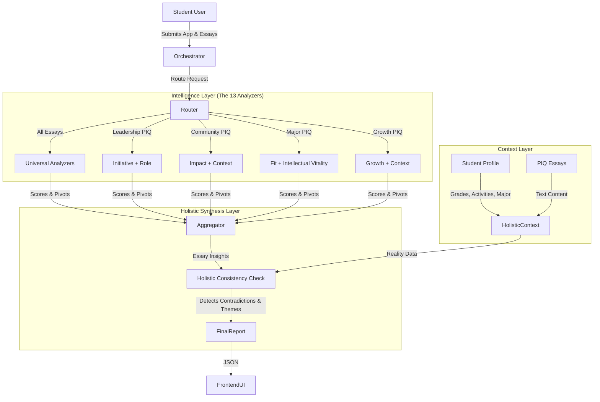

# Phase 4: Unified Orchestrator Design & Holistic Roadmap

**Status:** Draft
**Date:** 2025-11-19
**Goal:** Define the architecture for the "Central Brain" that integrates individual LLM analyzers, student profile data, and holistic application context.

---

## 1. Executive Summary

The **Unified Orchestrator** is the intelligence engine that sits above the individual analyzers. While Phase 3 built the "specialists" (e.g., the Voice Analyzer, the Leadership Analyzer), Phase 4 builds the "conductor" that decides *who* analyzes *what* and synthesizes the results into a coherent admissions strategy.

Crucially, this Orchestrator introduces the **Holistic Application Analyzer**, a meta-layer that ensures the essays align with the student's actual activities, grades, and stated goals.

---

## 2. System Architecture



---

## 3. Routing Logic (The "Specialist" Map)

Not every essay needs every analyzer. The Orchestrator intelligently routes essays based on their **Prompt Type** or **Topic Classification**.

| PIQ / Topic | Primary Analyzers (Deep Dive) | Secondary Analyzers (Validation) |
| :--- | :--- | :--- |
| **Universal** (All Essays) | **Voice & Style**, **Craft & Language**, **Specificity**, **Narrative Arc** | **Thematic Coherence** |
| **PIQ 1 (Leadership)** | **Initiative & Leadership**, **Role Clarity** | Community Impact |
| **PIQ 2 (Creativity)** | **Intellectual Vitality**, **Identity** | Specificity |
| **PIQ 3 (Talent)** | **Identity**, **Personal Growth** | Intellectual Vitality |
| **PIQ 4 (Opp/Barrier)** | **Context & Circumstances**, **Personal Growth** | Specificity |
| **PIQ 5 (Challenge)** | **Personal Growth**, **Context & Circumstances** | Narrative Arc |
| **PIQ 6 (Academic)** | **Fit & Trajectory**, **Intellectual Vitality** | Initiative |
| **PIQ 7 (Community)** | **Community Impact**, **Role Clarity** | Identity |
| **PIQ 8 (Beyond)** | **Identity**, **Thematic Coherence** | Specificity |

---

## 4. The Holistic Application Analyzer (Meta-Layer)

This is the "Admissions Officer Simulation." It doesn't just look at the text; it looks at the **truth**.

### Core Functions:

1.  **Reality Check (Claim Validation 2.0)**
    *   *Input:* Essay says "I founded the club."
    *   *Profile:* Activity list says "Member, 2 hrs/week."
    *   *Result:* **Flagged Contradiction.** "Your essay claims founder status, but your activity log lists you as a member. Admissions officers will spot this discrepancy."

2.  **Trajectory Verification**
    *   *Input:* Essay is about "Passion for History."
    *   *Profile:* Intended Major is "Computer Science."
    *   *Result:* **Strategic Gap.** "Your essay shows deep passion for History, but you applied for CS. You need to bridge this gap or explain the interdisciplinary connection."

3.  **Thematic Consistency ("The Golden Thread")**
    *   *Input:* Essay 1 (Compassion), Essay 2 (Ruthless efficiency), Essay 3 (Lone wolf).
    *   *Result:* **Incoherent Persona.** "Your essays present conflicting personality traits. Essay 1 argues you are a compassionate community builder, while Essay 2 depicts you as a ruthless efficiency expert. We need to unify these into a 'Compassionate Efficient Leader' narrative."

---

## 5. Data Structures

### The `HolisticAnalysis` Object

```typescript
interface HolisticAnalysis {
  student_id: string;
  overall_quality: 'Ready' | 'Strong' | 'Competitive' | 'Developing' | 'Risky';
  
  // Aggregated scores from all essays
  portfolio_scores: {
    intellectual_vitality: number; // Avg across essays
    leadership_capacity: number;
    community_impact: number;
    personal_character: number;
  };

  // The "Red Flags" - Contradictions between Story and Reality
  consistency_checks: Array<{
    type: 'contradiction' | 'gap' | 'alignment';
    severity: 'critical' | 'warning' | 'positive';
    message: string; // "Essay claims 500 hours, Activity log shows 50."
    source_essay: string;
    source_activity: string;
  }>;

  // The "Golden Thread" - What defines this student?
  thematic_profile: {
    identified_archetype: string; // e.g., "The Tech Humanist"
    core_values: string[]; // ["Empathy", "Innovation", "Resilience"]
    narrative_cohesion_score: number; // 0-10
  };

  // Next Steps
  strategic_recommendations: string[];
}
```

---

## 6. Implementation Roadmap

### Step 1: The Router (Orchestrator Service)
- Create `src/services/orchestrator/essayOrchestrator.ts`
- Implement `analyzeEssay(text, promptType)`
- Parallelize API calls for speed (Promise.all).

### Step 2: The "Holistic Context" Interface
- Define the `StudentProfile` interface clearly (extracting from the existing `database/types.ts` but optimized for LLM consumption).
- Update `Fit & Trajectory` analyzer to accept `intendedMajor`.

### Step 3: The Holistic Analyzer
- Create `src/services/orchestrator/holisticAnalyzer.ts`.
- Build the prompt that takes `[Profile Summary] + [Essay Summaries]` and outputs the `HolisticAnalysis`.

### Step 4: Integration
- Expose via MCP Tool: `analyze_full_application`.
- Connect to Frontend.

---

## 7. Why This is "Extremely Capable & Robust"

1.  **No Silos:** Analyzers talk to each other via the Aggregator.
2.  **Reality Grounding:** We don't just grade writing; we grade *truth* by checking against the profile.
3.  **Strategic Focus:** The output isn't just "fix this sentence"; it's "fix this *application strategy*."
4.  **Scalable:** New analyzers can be plugged into the Router without breaking the holistic check.

